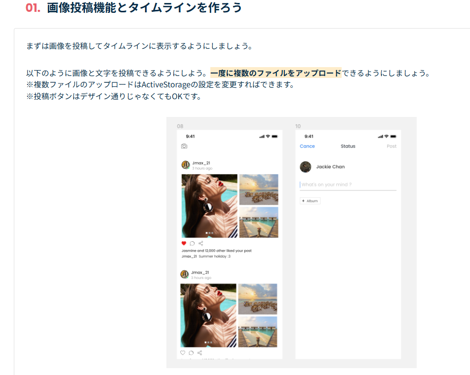
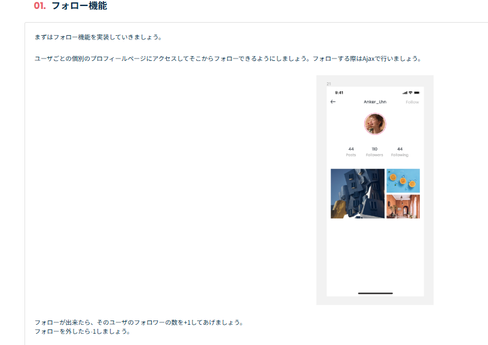
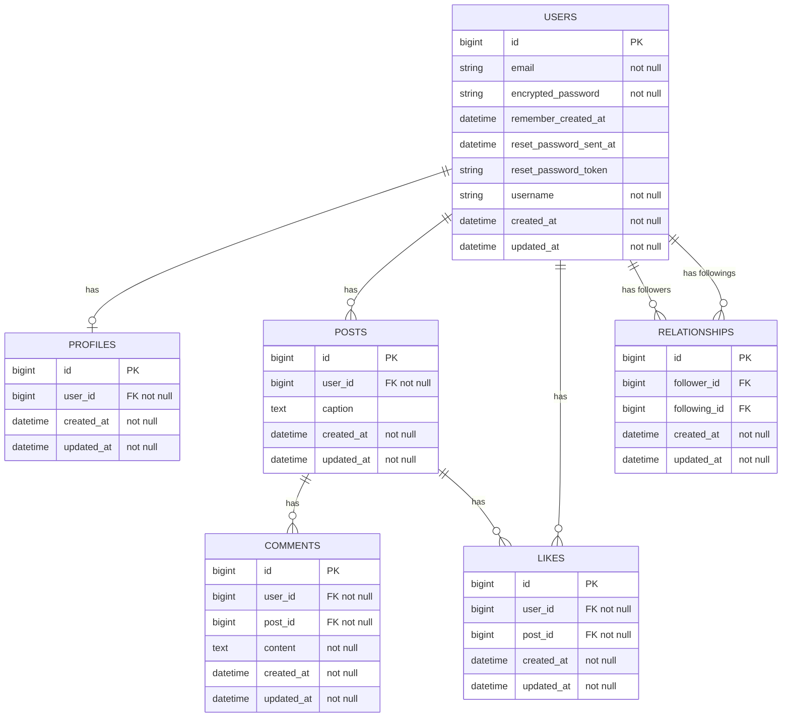
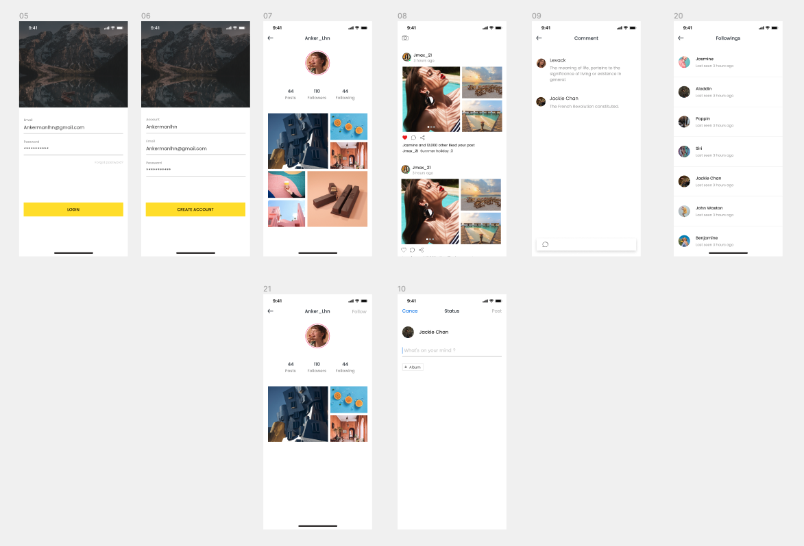

## 使用技術
### バックエンド

### フロントエンド

### インフラ・DB

### 使用ツール

## 使用イメージ
### 登録・画像設定
https://github.com/user-attachments/assets/aab65487-459a-48dc-9c2c-fba315786e7f

### 画像投稿・閲覧・いいね
https://github.com/user-attachments/assets/51967b4e-6b86-4103-920e-93db95d232ec

### フォロー
https://github.com/user-attachments/assets/3123f7ad-edf7-4c8b-9534-5ff357c725ed

## 機能一覧
| 機能       | 詳細                                                              |
|:---------|:----------------------------------------------------------------|
| ログイン機能 | Gem : deviseを使用。アカウント名が入力できるようカスタマイズ|
| プロフィール画像設定 | JavaScriptを使用し、アップロード処理を非同期処理で実装　                          |
| 画像投稿機能 | 画像と文字の投稿機能。複数の画像ファイルのアップロードに対応|
| タイムライン | 投稿者、投稿時間、投稿内容を表示。いいね・コメント・シェアボタンを配置 |
| いいね機能 | Ajaxで「いいね」機能を実装。ハートマークのボタンを押すと「いいね」が可能 |
| コメント機能  | Ajaxでコメント機能を実装。コメントには投稿者の名前とプロフィール画像を表示 |
| フォロー機能  | 個別のユーザープロフィールページからフォローできる機能。フォローしたユーザーの投稿のみを表示するタイムラインも作成 |

## 指示内容サンプル
本アプリケーションは以下のような指示に沿って作成しました。
実装方法についての具体的な指示やハンズオンはありません。

## ER図

## 画面遷移図

## 難しかったところ
### いいね機能やフォロー機能の中間テーブル
中間テーブルの理解に苦戦しました。どういった構造が必要になるのかを紙に手書きをして整理したうえで実装しました。
また、自身の理解を深めるためQiita記事にてアウトプットしました。
（参考）[【Rails】いいね機能の実装ー中間テーブルとはなにか？ー](https://qiita.com/Omi354/items/7afc5a3512e086c0d35f)

### 画面の実装
Ajaxを使った非同期処理とRails側の通信のイメージがなかなかできずに苦戦しました。特に開発初期の慣れていない頃に実装したプロフィールページの画像投稿を非同期で行う箇所に時間がかかりました。通信の流れをなるべく具体的にイメージしながら実装することで、少しずつ理解を深めることができました。

### Rubyのバージョンアップ対応とRenderでのデプロイ
もともとRuby2.7系を使用していましたが、Renderで使用可能なバージョンが3.1以上だったためアプリケーション作成後、デプロイ直前でバージョンアップしました。RSpecにてテストコードを記載していたため、エラーが出る箇所の特定が早く済み、改修の工数を削減できました。一方でデプロイの際に複数エラーが発生し、対応に苦戦しました（参考）[【デイトラ】Webアプリ開発コースで作成したRailsアプリをRender.comでデプロイする方法](https://qiita.com/Omi354/items/4b582435aa17705715c9)

## 作成過程（Qiita記事）
[deviseで作成したUserモデルに自分で設定したいフィールドを追加する方法](https://qiita.com/Omi354/items/1e4e361fa76b4e70e09a)

[Railsでアバター画像が設定されていないときにプロフィール編集ページにリダイレクトする設定方法](https://qiita.com/Omi354/items/855a4cb07521d4205474)

[プロフィール画像の編集を非同期処理で実装する方法](https://qiita.com/Omi354/items/8ea1d83ec4f637b9c595)

[【Rails】いいね機能の実装ー中間テーブルとはなにか？ー](https://qiita.com/Omi354/items/7afc5a3512e086c0d35f)

[View側の繰り返し処理に対応してJavaScriptで動的にidを取得する方法](https://qiita.com/Omi354/items/80bf3eac3a7e25cd6315)

[【Rails】json形式のレスポンスを整形して、画像ファイルのURLをフロントに渡す方法](https://qiita.com/Omi354/items/4c320fc43ae48ed806ed)

[【Rails】メンション付きコメントがあった際にメールで通知をする方法](https://qiita.com/Omi354/items/fed81354bff963fea546)

[【Rails】RSpecでのテスト時に詰まったところ～画像の添付、postリクエスト時のパラメーター付加など～](https://qiita.com/Omi354/items/763f5104003e65095f25)

[【デイトラ】Webアプリ開発コースで作成したRailsアプリをRender.comでデプロイする方法](https://qiita.com/Omi354/items/4b582435aa17705715c9)
